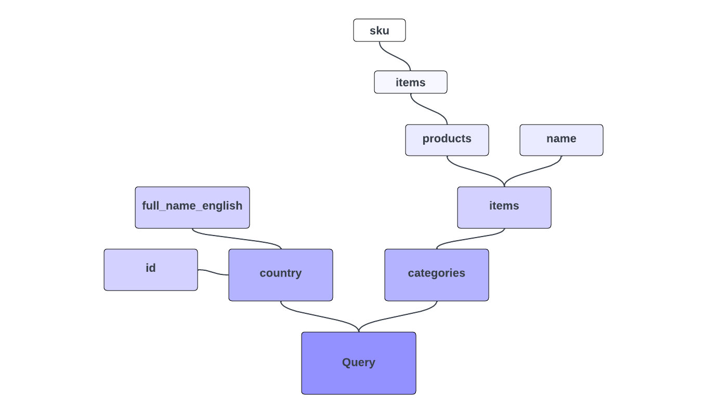

# GraphQL-frågor

Detta är en del 2 av serien för GraphQL och Adobe Commerce. I den här självstudiekursen och videon får du lära dig mer om GraphQL-frågor och hur du utför dem mot Adobe Commerce.

>[!VIDEO](https://video.tv.adobe.com/v/3424120?learn=on)

## Relaterade videor och självstudiekurser om GraphQL i den här serien

* [Del 1 GraphQL - Introduktion](../graphql-rest/intro-graphql.md)
* [Del 3 GraphQL - Mutationer](../graphql-rest/graphql-mutations.md)
* [Del 4 GraphQL - schema](../graphql-rest/graphql-schema.md)

## Exempel på GraphQL Syntax

Låt oss dyka rakt in i GraphQL frågesyntax med ett fullfjädrat exempel. (Kom ihåg att du själv kan prova detta mot https://venia.magento.com/graphql.)

Observera följande GraphQL-fråga, som är uppdelad bit för bit:

```graphql
{
    country (
        id: "US"
    ) {
        id
        full_name_english
    }

    categories(
        filters: {
            name: {
                match: "Tops"
            }
        }
    ) {
        items {
            name
            products(
                pageSize: 10,
                currentPage: 2
            ) {
                items {
                    sku
                }
            }
        }
    }
}
```

Ett trovärdigt svar från en GraphQL-server på ovanstående fråga kan vara:

```json
{
  "data": {
    "country": {
      "id": "US",
      "full_name_english": "United States"
    },
    "categories": {
      "items": [
        {
          "name": "Tops",
          "products": {
            "items": [
              {
                "sku": "VSW06"
              },
              {
                "sku": "VT06"
              },
              {
                "sku": "VSW07"
              },
              {
                "sku": "VT07"
              },
              {
                "sku": "VSW08"
              },
              {
                "sku": "VT08"
              },
              {
                "sku": "VSW09"
              },
              {
                "sku": "VT09"
              },
              {
                "sku": "VSW10"
              },
              {
                "sku": "VT10"
              }
            ]
          }
        }
      ]
    }
  }
}
```

Exemplet ovan bygger på det färdiga GraphQL-schemat för Adobe Commerce som definierats på servern. I den här förfrågan
fråga flera typer av data samtidigt. Frågan uttrycker exakt de fält som du vill ha och returnerade data formateras
liknar själva frågan.

>[!NOTE]
>
>GraphQL-klienter missar formen på den faktiska HTTP-begäran som skickas, men detta är lätt att upptäcka. Om du använder en webbläsarbaserad klient bör du följa fliken [!UICONTROL Network] när en fråga skickas. Du ser att begäran innehåller en obearbetad text som består av frågan `{string}`, där `{string}` bara är råsträngen för hela frågan. Om begäran skickas som GET kan frågan kodas i frågesträngsparametern &quot;query&quot; i stället. Till skillnad från med REST spelar HTTP-begärandetypen ingen roll, bara innehållet i frågan.


## Frågar efter det du vill ha

`country` och `categories` i exemplet representerar två olika&quot;frågor&quot; för två olika typer av data. Till skillnad från en traditionell API-paradigm som REST, som skulle definiera separata och explicita slutpunkter för varje datatyp. GraphQL ger dig flexibilitet att fråga efter en enda slutpunkt med ett uttryck som kan hämta många typer av data samtidigt.

På samma sätt anger frågan exakt de fält som är önskade för både `country` (`id` och `full_name_english`) och `categories` (`items`, som i sin tur har ett delurval av fält), och de data som du tar emot speglar den fältspecifikationen. Det finns förmodligen många fler fält tillgängliga för dessa datatyper, men du kommer bara tillbaka det du begärde.


>[!NOTE]
>
>Du kan lägga märke till att returvärdet för `items` faktiskt är en _array_ med värden, men du väljer ändå delfält direkt för den. När fälttypen är en lista förstår GraphQL undermarkeringar som ska användas på varje objekt i listan.

## Argument

De fält som du vill returnera anges inom klammerparenteserna för varje typ, men namngivna argument och värden för dem anges inom parenteser efter typnamnet. Argumenten är ofta valfria och påverkar ofta hur frågeresultaten filtreras, formateras eller omformas.

Du skickar ett `id`-argument till `country`, anger det land som ska frågas och ett `filters`-argument för `categories`.

## Fält hela vägen ned

Även om du tenderar att tänka på `country` och `categories` som separata frågor eller entiteter, så består hela trädet som uttrycks i din fråga egentligen bara av fält. Uttrycket för `products` skiljer sig syntaktiskt från uttrycket för `categories`. Båda är fält och det är ingen skillnad på deras konstruktion.

Alla GraphQL-datagrafer har en enda &quot;rottyp&quot; (som vanligtvis kallas `Query`) för att starta trädet, och de typer som oftast betraktas som entiteter tilldelas fält på den här roten. Exempelfrågan skapar en allmän fråga för rottypen och markerar fälten `country` och `categories`. Sedan väljs delfält för dessa fält, och så vidare, som kan vara flera nivåer djupa. Om returtypen för ett fält är en komplex typ (till exempel en med egna fält i stället för en skalär typ) fortsätter du att markera de fält du vill ha.

Det här konceptet med kapslade fält är också anledningen till att du kan skicka argument för `products` (`pageSize` och `currentPage`) på samma sätt som du gjorde för fältet `categories` på den översta nivån.



## Variabel

Låt oss testa en annan fråga:

```graphql
query getProducts(
    $search: String
) {
    products(
        search: $search
    ) {
        items {
            ...productDetails
            related_products {
                ...productDetails
            }
        }
    }
}

fragment productDetails on ProductInterface {
    sku
    name
}
```

Det första att notera är att nyckelordet `query` har lagts till före frågans inledande parentes, tillsammans med ett åtgärdsnamn (`getProducts`). Det här åtgärdsnamnet är godtyckligt. Det motsvarar ingenting i serverschemat. Den här syntaxen lades till för att stödja introduktionen av variabler.

I föregående fråga får du hårdkodade värden för argumenten i fälten direkt, som strängar eller heltal. GraphQL-specifikationen har dock förstklassigt stöd för att separera användarindata från huvudfrågan med hjälp av variabler.

I den nya frågan använder du parenteser före den inledande klammerparentesen för hela frågan för att definiera en `$search`-variabel (variabeln använder alltid dollartecknets prefixsyntax). Det är den här variabeln som anges för argumentet `search` för `products`.

När en fråga innehåller variabler förväntas GraphQL-begäran innehålla en separat JSON-kodad värdesordlista bredvid själva frågan. För frågan ovan kan du skicka följande JSON med variabelvärden förutom frågetexten:

```json
{
    "search": "VT01"
}
```

>[!NOTE]
>
>Om du testar de här frågorna mot exempelwebbplatsen för Venia i stället för din egen Adobe Commerce-instans, är det troligt att de returnerade resultaten är tomma för `related_products`.

I alla GraphQL-kompatibla klienter som du använder för testning (till exempel Altair och GraphiQL), stöder användargränssnittet att du anger variablerna JSON separat från frågan.

Precis som du såg att den faktiska HTTP-begäran för en GraphQL-fråga innehåller frågan `{string}` i sin brödtext, innehåller alla begäranden som innehåller en variabelordlista bara ytterligare variabler: `{json}` i samma brödtext, där `{json}` är JSON-strängen med variabelvärdena.

Den nya frågan använder också ett _fragment_ (`productDetails`) för att återanvända samma fältval på flera platser. [Läs mer om fragment](https://graphql.org/learn/queries/#fragments){target="_blank"} i GraphQL-dokumentationen.

{{$include /help/_includes/graphql-rest-related-links.md}}
