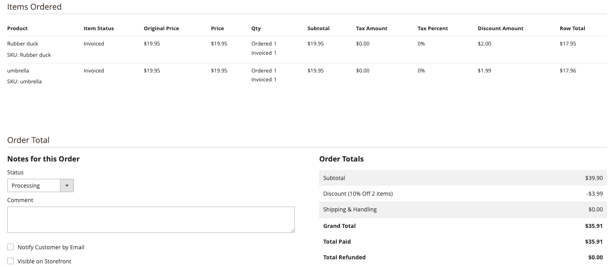

# Skapa en kundprisregel

Kundprisreglerna tillämpar rabatter på artiklar i kundvagnen, baserat på en uppsättning villkor. Rabatten kan tillämpas automatiskt när villkoren är uppfyllda eller när kunden anger en giltig kupongkod. När rabatten används visas den i kundvagnen under delsumman. En kundprisregel kan användas efter behov för en säsong eller en befordran genom att ändra dess status och datumintervall.

## Vem är den här videon till?

- eCommerce-marknadsförare
- Webbplatschefer

## Videoinnehåll

>[!VIDEO](https://video.tv.adobe.com/v/343835?quality=12&learn=on)

## Prissättningsproblem

Det finns några unika scenarier som kräver att varje radobjekt visar sin rabatt, men värdena kanske inte matchar exakt. Orsaken är att en kundprisregel ger rabatt på flera produkter men värdena inte fördelas jämnt i två decimaler.

>[!BEGINSHADEBOX]

Prisregel = 10 % rabatt på 2 produkter i kundvagnen
Villkor för att prisregeln ska börja gälla: det totala antalet artiklar i kundvagnen är 2
Funktionsmakron används i procent av produktprisrabatten och rabattbeloppet är 10

2 artiklar läggs till i kundvagnen. Varje är 19,95 USD

För att få rabatten multiplicerar du produktpriset med 0,1

19,95 x 0,1 = 1,995

Det här är problemet, vi har tre decimaler istället för två. Att konvertera detta till dollar är nu ett problem

>[!ENDSHADEBOX]

### Lösningen

Med tanke på webbplatsägaren, som är den enda person som påverkas av detta problem, fastställdes att det var lämpligast att visa varje beställd artikel med rabatten i dollar. För att säkerställa att hela orderbeloppet beräknades korrekt beslutades det att den första posten skulle avrundas och de andra att den tredje decimalen skulle strykas. Granska det här scenariot:

>[!BEGINSHADEBOX]

Samma rabatt på 10 % som ovan gällande kundvagnsregel
Lägg två produkter i varukorgen som är 19,95

Varje produkt bör få rabatter på 1 995 dollar
Produkt 1 - 19,95 x 0,1 = 1,995
2 - 19,95 x 0,1 = 1,995

Totalsumman 3,99 ges som rabatt till kunden

När radobjekten visas för butiksägaren i administratören,
måste vi justera det första objektet och avrunda det till 2 000. Det andra objektet vi släpper den tredje decimaltecknet
Produkt 1 = 2,00
Produkt 2 = 1,99

Den totala rabatten för de två produkterna motsvarar nu den faktiska rabatten som kunden får.
>[!ENDSHADEBOX]

Här är en skärmbild som den skulle visa i administratören för en order som har det här scenariot:

### Andra potentiella lösningar och varför de inte användes

>[!BEGINSHADEBOX]

Samma rabatt på 10 % som ovan gällande kundvagnsregel
Lägg två produkter i varukorgen som är 19,95

Varje produkt bör få 1 995 dollar i rabatt,
Men om vi just har rundat av dem så visas för mycket rabatt.

Produkt 1 - 19,95 x 0,1 = 1,995
Produkt 2 - 19,95 x 0,1 = 1,995

Konvertera för att avrunda alla objekt
Produkt 1 Nytt värde är 2,00
Produkt 2 Nytt värde är 2,00

Det totala beloppet på 3,99 tillhandahölls faktiskt som rabatt till kunden,
Men om vi skulle slå ihop dem skulle det visa att 4,00 dollar gavs och det är felaktigt.

2.00 + 2.00 = $4.00

>[!ENDSHADEBOX]

Liknande problem om den tredje decimalen utelämnades för alla artiklar skulle det visa för lite rabatt.

>[!BEGINSHADEBOX]

Samma rabatt på 10 % som ovan gällande kundvagnsregel
Lägg två produkter i varukorgen som är 19,95

Varje produkt bör få 1,995 USD i rabatt, men om vi bara släpper den tredje decimalen så händer detta:
Produkt 1 - 19,95 x 0,1 = 1,995
Produkt 2 - 19,95 x 0,1 = 1,995

Konvertera för att släppa den tredje decimalen för alla objekt
Produkt 1 Nytt värde är 1,99
Produkt 2 Nytt värde är 1,99

Det totala beloppet på 3,99 tillhandahölls faktiskt som rabatt till kunden,
Men om vi släpper den tredje decimaltecknet skulle det visa att 3,98 USD gavs och det är felaktigt.

1,99 + 1,99 = $3,98

>[!ENDSHADEBOX]

## Ytterligare resurser

- [Skapa en kundprisregel - [!DNL Commerce] Handbok för marknadsföring och marknadsföring](https://experienceleague.adobe.com/docs/commerce-admin/marketing/promotions/cart-rules/price-rules-cart-create.html?lang=sv-SE)
- [Kupongkoder - [!DNL Commerce] Handbok för marknadsföring och kampanjer](https://experienceleague.adobe.com/docs/commerce-admin/marketing/promotions/cart-rules/price-rules-cart-coupon.html?lang=sv-SE)
